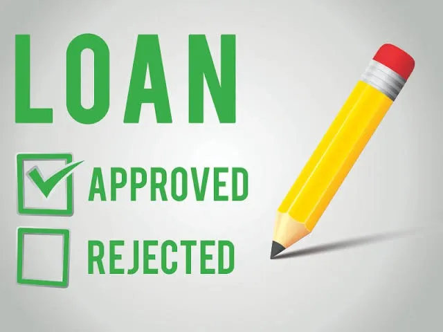

# Credit Risk Modelling - Loan Classification

In this Project, we are creating a loan approval prediction system using Python and also it's **GUI** representation.
   

## Libraries
- Numpy
- Pandas
- Matplotlib
- Scikit
- Seaborn
  

## Algorithms
-  Decision Tree Classifier
-  K-Neighbours
-  Logistic Regression
-  Gradient Boosting Classifier
-  XGBoost Classifier

## HyperParameter Tunning
-  Grid Search CV

## Steps followed

- **Data Understanding** - Completeness and correctness of data collection  
- **Data preparation** - cleansing and preparing data for the next steps of model development  
- **Algorithm Understanding** - Knowledge of the algorithm used for model development  
- **Model Selection** - Selection of the Model with best Score on test  
- **Model Tuning** - Improving the model performance by tuning the hyper parameters  
- **Model Evaluation** - Testing the model on sufficient sample for correctness  

